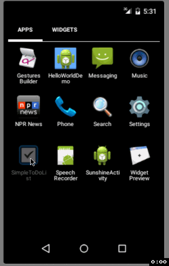

# Android Pre-work (Project 0): Simple ToDo App

This is the Android ToDo list application implemented using Eclipse ADT.

Completed User Stories:

* [X] Successfully add & remove items from todo list
* [X] Editing of todo list items. Launches EditItemActivity
* [X] ~~Persist list items to file on app close and read from file on app open.~~ Persist items to SQLite.
* [X] List view using custom adapter
* [X] Completion due date for each todo items (displayed in list view)
* [X] Pushed to github
* [X] Readme with GIF walk through
* [X] Create issue on repo

